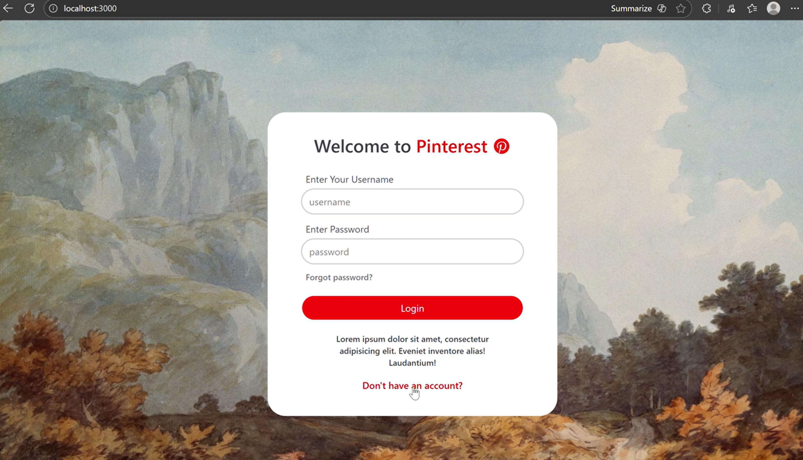
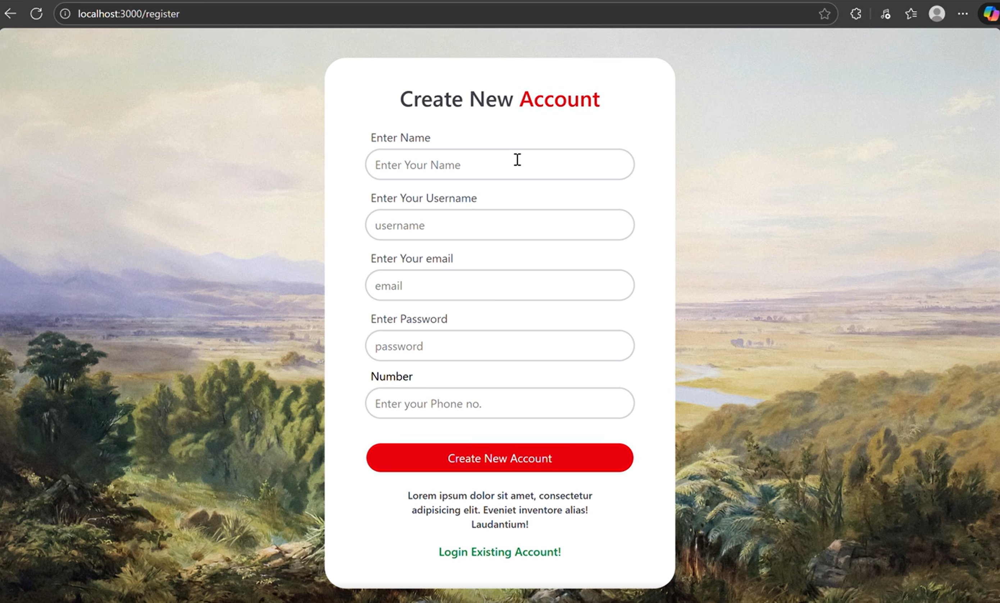
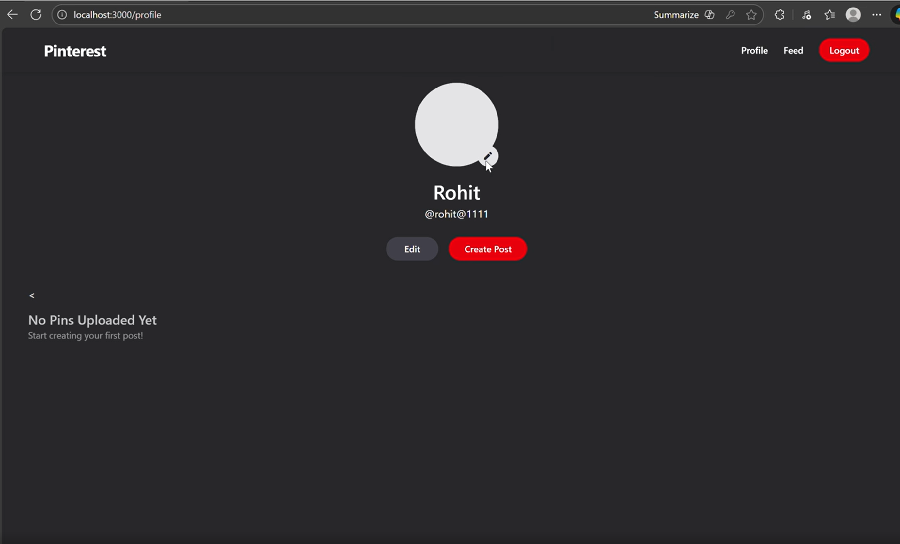
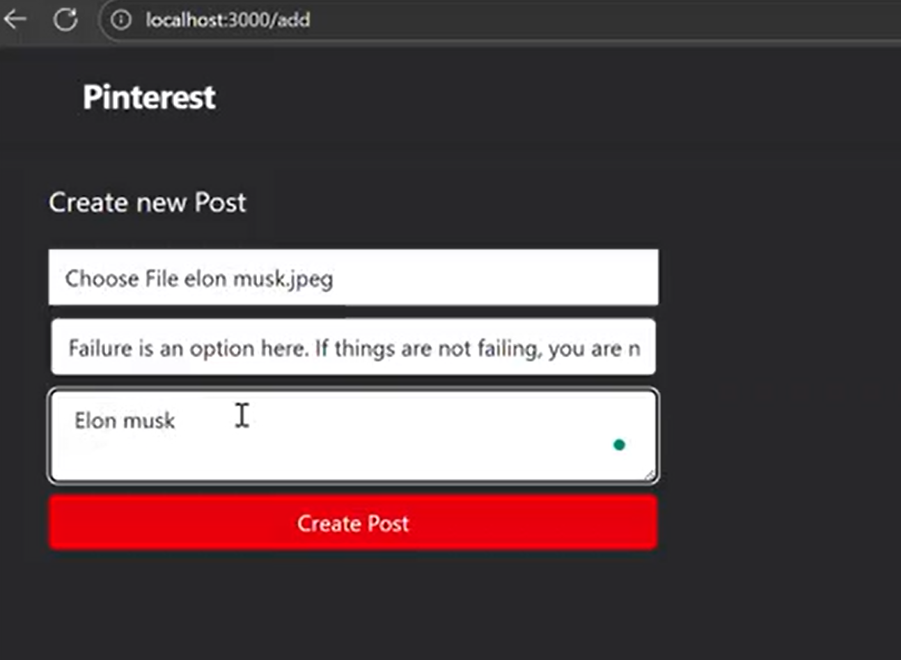
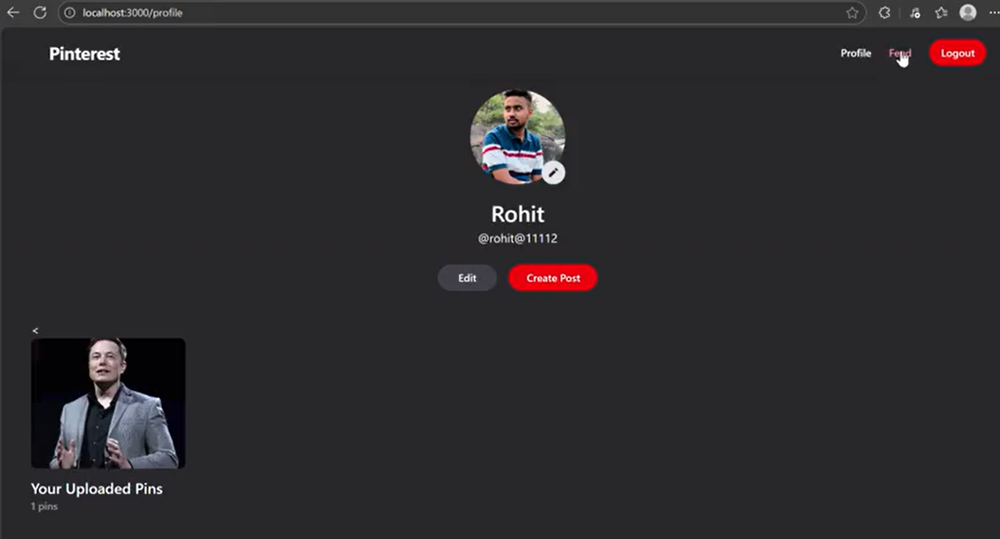

# 📌 Pinterest Clone

A full-stack **Pinterest-inspired social media web application** built
with **Node.js, Express.js, MongoDB, EJS, and JavaScript**.

The application allows users to create accounts, upload image-based
posts, browse a feed, manage their profile, and interact with uploaded
content through a Pinterest-style interface.

------------------------------------------------------------------------

## 🚀 Project Overview

This project is a backend-focused Pinterest Clone created to understand
how a real-world social media application works.

It includes:

- User authentication
- User profiles
- Image uploads
- Post creation
- Feed functionality
- Profile management
- Session-based user access
- MongoDB data storage
- Dynamic EJS pages
- Express.js routing
- Static asset management

The project follows a modular Express.js structure with separate routes,
views, public assets, and application logic.

------------------------------------------------------------------------

## 📸 Project Screenshots

### 🏠 User Profile

<p align="center">
  
</p>

### ➕ Create New Post

<p align="center">
  
</p>

### 📌 Uploaded Pins

<p align="center">
  
</p>
<p align="center">
  
</p>

### ➕ Create New Post

<p align="center">
  
</p>


> **Note:** Keep the screenshots inside a `screenshots` folder in the
> repository. If your image filenames are different, update the paths
> above accordingly.

------------------------------------------------------------------------

## ✨ Features

### 👤 User Management

- User registration
- User login
- Session-based authentication
- User profile
- Profile editing
- Profile image support
- Logout functionality

### 📌 Post Management

- Create a new post
- Upload an image
- Add post content/details
- Display uploaded pins
- View posts on the profile/feed

### 🖼️ Image Uploads

- Image upload functionality
- Server-side upload handling
- Uploaded files stored through the application's upload system
- Static access to uploaded images

### 🧭 Navigation

- Profile
- Feed
- Logout
- Create Post
- User-specific content

------------------------------------------------------------------------

## 🛠️ Tech Stack

### Backend

- **Node.js**
- **Express.js**

### Frontend

- **EJS**
- **HTML5**
- **CSS3**
- **JavaScript**

### Database

- **MongoDB**

### Other Tools & Technologies

- Express Router
- Multer for file uploads
- Sessions / authentication middleware
- npm
- Git & GitHub

------------------------------------------------------------------------

## 🏗️ Project Structure

``` text
PINTEREST/
│
├── node_modules/
│
├── public/
│   ├── images/
│   │   └── uploads/
│   │
│   ├── javascripts/
│   │
│   └── stylesheets/
│       └── style.css
│
├── routes/
│   ├── index.js
│   ├── multer.js
│   ├── post.js
│   └── users.js
│
├── views/
│   └── [EJS Templates]
│
├── app.js
├── package.json
├── package-lock.json
└── README.md
```

------------------------------------------------------------------------

## 📂 Folder & File Explanation

| File / Folder            | Purpose                               |
|--------------------------|---------------------------------------|
| `app.js`                 | Main Express application              |
| `routes/index.js`        | Main application routes               |
| `routes/users.js`        | User-related routes and functionality |
| `routes/post.js`         | Post creation and post-related routes |
| `routes/multer.js`       | Image upload configuration            |
| `views/`                 | Dynamic EJS pages                     |
| `public/stylesheets/`    | CSS styling                           |
| `public/javascripts/`    | Frontend JavaScript                   |
| `public/images/uploads/` | Uploaded images                       |
| `package.json`           | Project dependencies and scripts      |
| `package-lock.json`      | Locked dependency versions            |

------------------------------------------------------------------------

## 🔄 Application Flow

``` text
                    ┌──────────────────┐
                    │      User        │
                    └────────┬─────────┘
                             │
                             ▼
                    ┌──────────────────┐
                    │   Express App    │
                    │     app.js       │
                    └────────┬─────────┘
                             │
              ┌──────────────┼──────────────┐
              ▼              ▼              ▼
        ┌──────────┐   ┌──────────┐   ┌──────────┐
        │  Users   │   │  Posts   │   │  Uploads │
        │  Routes  │   │  Routes  │   │  Multer  │
        └────┬─────┘   └────┬─────┘   └────┬─────┘
             │              │              │
             └──────────────┼──────────────┘
                            ▼
                    ┌──────────────────┐
                    │     MongoDB      │
                    └────────┬─────────┘
                             │
                             ▼
                    ┌──────────────────┐
                    │  EJS Templates   │
                    └────────┬─────────┘
                             │
                             ▼
                    ┌──────────────────┐
                    │  Browser / UI    │
                    └──────────────────┘
```

------------------------------------------------------------------------

## ⚙️ Installation & Setup

### 1. Clone the Repository

``` bash
git clone https://github.com/rohit-thecoder/Pinterest-clone-
```

### 2. Navigate to the Project

``` bash
cd pinterest
```

### 3. Install Dependencies

``` bash
npm install
```

### 4. Configure Environment Variables

Create a `.env` file in the project root.

Example:

``` env
MONGODB_URI=your_mongodb_connection_string
SESSION_SECRET=your_session_secret
```

> Use the exact environment variable names required by your `app.js` and
> route files.

### 5. Start the Application

For development:

``` bash
npm start
```

If your project does not have a `start` script, run:

``` bash
node app.js
```

The application will typically be available at:

``` text
http://localhost:3000
```

------------------------------------------------------------------------

## 🔐 Authentication

The application includes user authentication and session-based access.

Typical flow:

``` text
Register
   ↓
Login
   ↓
Session Created
   ↓
Authenticated User
   ↓
Profile / Feed / Create Post
   ↓
Logout
   ↓
Session Destroyed
```

------------------------------------------------------------------------

## 📌 Creating a Post

Users can create a new post by:

1.  Opening the **Create Post** page.
2.  Selecting an image.
3.  Entering the required post information.
4.  Submitting the form.
5.  The server processes the uploaded image.
6.  The post is stored and displayed in the user's content.

------------------------------------------------------------------------

## 🖼️ Image Upload System

The project uses a dedicated upload route/configuration:

``` text
routes/multer.js
```

Uploaded images are handled through the application's upload workflow
and served from:

``` text
public/images/uploads/
```

------------------------------------------------------------------------

## 🎯 Learning Objectives

This project was built to gain practical experience with:

- Node.js backend development
- Express.js architecture
- REST-style routing
- MongoDB integration
- EJS templating
- User authentication
- Session management
- File uploads with Multer
- Dynamic web pages
- MVC-style project organization
- Frontend and backend integration

------------------------------------------------------------------------

## 🔮 Future Improvements

Possible improvements for future versions:

- [ ] Pinterest-style masonry feed
- [ ] Like and save functionality
- [ ] Comments
- [ ] Follow / unfollow users
- [ ] Search functionality
- [ ] Categories and boards
- [ ] Personalized recommendations
- [ ] Responsive mobile UI
- [ ] Cloud image storage
- [ ] Better authentication security
- [ ] Password hashing and validation improvements
- [ ] REST API documentation
- [ ] Production deployment

------------------------------------------------------------------------

## 📚 What I Learned

Building this project helped me understand how different parts of a
full-stack application work together:

**Frontend → Express Routes → Business Logic → Database → Response →
Dynamic UI**

I also gained hands-on experience with:

- Routing
- Middleware
- Authentication
- File uploads
- Database operations
- EJS rendering
- Static files
- Session handling
- Project structuring

------------------------------------------------------------------------

## 🚀 Future Deployment

The application can be deployed using platforms such as:

- Render
- Railway
- VPS / Cloud Server

For production deployment, environment variables and external
image/database storage should be configured securely.

------------------------------------------------------------------------

## 👨‍💻 Author

**Rohit Kumar**

B.Tech CSE \| Machine Learning & AI Enthusiast \| Full-Stack Developer

- **GitHub:** <https://github.com/rohit-thecoder>
- **LinkedIn:** <https://www.linkedin.com/in/rohitkumar2428/>

------------------------------------------------------------------------

## ⭐ Support

If you found this project useful, consider giving the repository a ⭐ on
GitHub.

------------------------------------------------------------------------

<div align="center">

### 🚀 Built with Node.js, Express.js, MongoDB & EJS ❤️

</div>
# Pinterest-clone-

# Pinterest-clone-

# Pinterest-clone-

